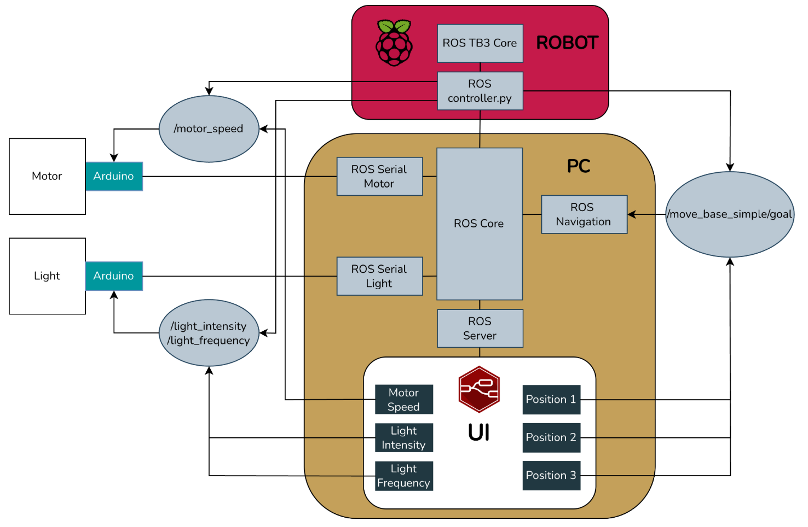
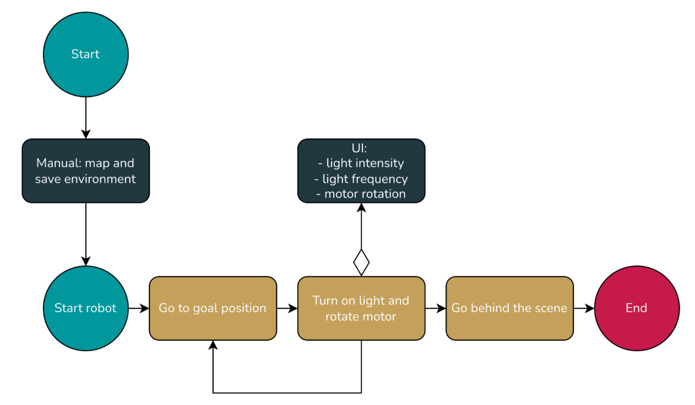
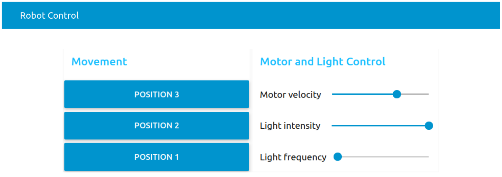
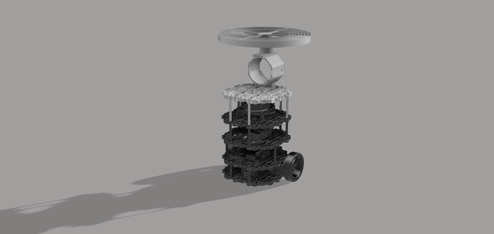
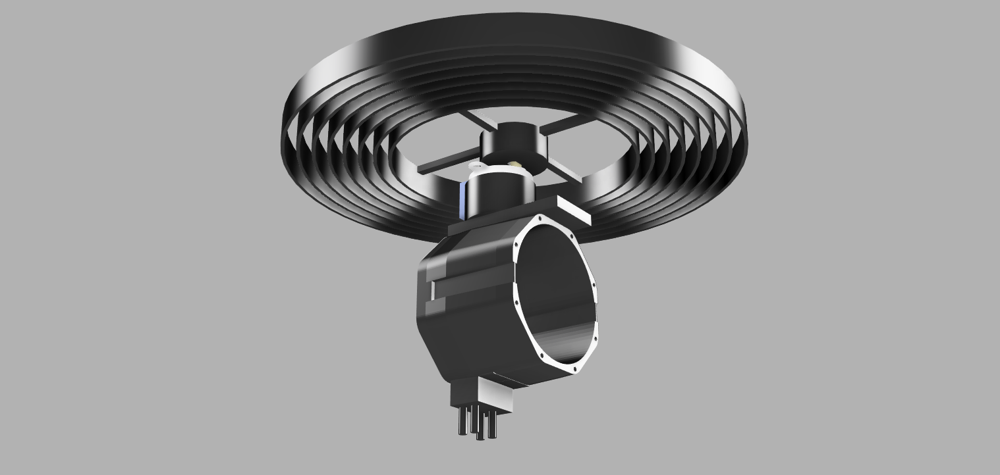
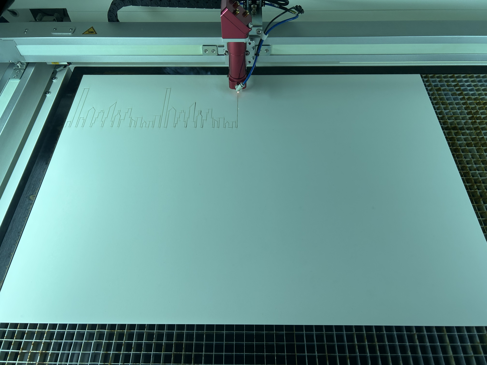

# Abstract

This project presents the design and implementation of a robotic scenographic system developed for a theatrical performance set on a train journey. Using a TurtleBot Burger, programmable lighting, and digitally fabricated components, the system projects dynamic shadows to simulate the perception of movement on stage. The project combines autonomous robot navigation, interactive control interfaces, and custom mechanical structures created through 3D printing and laser cutting. The result is a flexible and controllable scenic element that enhances the visual narrative of the performance through light and motion.

# Introduction

The objective of the project was to contribute to a stage performance through a technological element that enhances the visual narrative without interfering with the physical constraints of the play.

The theatrical piece is set during a train journey and is performed by a single actress who remains physically fixed to the stage, moving only from the ankles upwards. This limitation motivated the search for an alternative way to convey motion and spatial progression. To address this challenge, a TurtleBot Burger was adapted and extended with custom hardware to generate dynamic light and shadow effects on stage, simulating the changing landscape seen from a train window.

The project combines autonomous robot navigation, interactive control systems, and custom-designed mechanical components produced using 3D printing and laser cutting. Together, these elements form a flexible scenographic system capable of adapting to different moments of the performance and reinforcing the theatrical atmosphere through light, motion, and shadows.

## Concept

The core concept of the project is the use of moving shadows to suggest the sensation of travel and continuous motion within a static stage environment. By projecting silhouettes of external elements such as buildings, trees, or light poles, the system recreates the visual experience of observing the outside world through a train window.

This effect is achieved by mounting a programmable light source and a rotating structure with interchangeable silhouettes on top of a mobile robot. As the circular structure rotates, the projected shadows move across the stage, creating the illusion of a passing landscape. The distance between the light source and the silhouettes can be modified, allowing different shadow scales and visual depths.

This approach was particularly well suited to the play, as it adds dynamism to the scene without requiring additional actors or complex stage mechanisms. The robotic system remains in the background while its visual impact supports the narrative, reinforcing the idea of movement and transition that is central to the story.

## Organisation

The project was carried out by a team of two students. Due to living far from each other, in-person meetings outside scheduled class time were limited. As a result, a structured and continuous communication workflow was established.

Each week, during the class session, both team members shared and discussed the progress made individually throughout the previous week. After reviewing the current state of the project, development continued collaboratively during the class. At the end of each session, specific tasks were assigned to be completed before the following week.

In addition, any complications, technical issues, or new ideas that arose during the week were communicated via phone. When physical presence was required, such as for hardware assembly or testing, meetings were arranged before class sessions to work together on-site. This organization allowed the project to progress efficiently despite the physical distance between team members.

# System Design

## System Architecture

## Robot Flow

## Interface

# Hardware Designs

Several custom components were required to support the lighting system, the rotating shadow mechanism, and the additional electronics while maintaining stability and modularity.
Digital fabrication tools played a key role in this process. 3D printing was used to create structural and mechanical supports, while the laser cutting machine was employed to produce the shadow silhouettes and flat components. These techniques allowed for rapid iteration, precise customization, and easy adaptation of the system to the requirements of the performance.

## 3D Printing

3D printing was used to fabricate all custom structural components required to extend the TurtleBot Burger and integrate the lighting and shadow projection system. These parts were designed to be modular, lightweight, and easy to assemble, allowing the system to be mounted securely on top of the robot without interfering with its original structure or sensors.

The printed components include an additional base, support structures for the programmable light, and a vertical mount to hold the stepper motor responsible for rotating the shadow element. The light support was designed with multiple mounting positions on the base, enabling adjustments to its height and placement. Similarly, the motor could be mounted in different positions on the light support, providing flexibility in the overall configuration.
The rotating piece placed above the motor was also designed with several concentric positions to attach silhouette elements. This modular arrangement makes it possible to vary the distance between the light source and the silhouettes, which is a key aspect of the system. Adjusting this distance significantly affects the resulting shadows, influencing their size, sharpness, and overall visual appearance. This flexibility allows the system to adapt to different silhouettes and stage scenarios, producing distinct visual effects depending on the desired atmosphere.

In the image of the left, the custom 3D-printed components can be seen assembled on the TurtleBot Burger. The printed parts are shown in white, clearly distinguishable from the original robot components, which are black. This contrast highlights the added structures and their integration with the existing platform.

The right image shows only the 3D-printed parts prior to assembly. This view emphasizes the modular nature of the design and the variety of supports created to accommodate the different hardware elements. The use of 3D printing allowed rapid prototyping and iterative refinement of these components throughout the development process.

  
  

## Laser Cutting Machine

The laser cutting machine was used to fabricate the silhouette elements responsible for generating the projected shadows. For this purpose, it was necessary to select a material that was lightweight and easy to cut, while also being more resistant and stable than standard paper. A paper with higher grammage than a regular sheet was chosen, as it provided the required balance between rigidity, durability, and low weight.

The silhouettes were designed digitally and then cut using the laser cutting machine. This approach was significantly more efficient and less costly in terms of time and effort than manual cutting. Once the designs were prepared, the fabrication process was straightforward and easily repeatable.

One of the main reasons for using laser cutting was the high level of precision and the clean edges it provides. This aspect was especially important for the project, as small imperfections in the silhouettes become highly noticeable when projected as shadows. Clean and accurate cuts resulted in sharper, more defined shadows, directly improving the visual quality of the final scenographic effect.

# Process

# Challenges

# Future Work

# Conclusions

